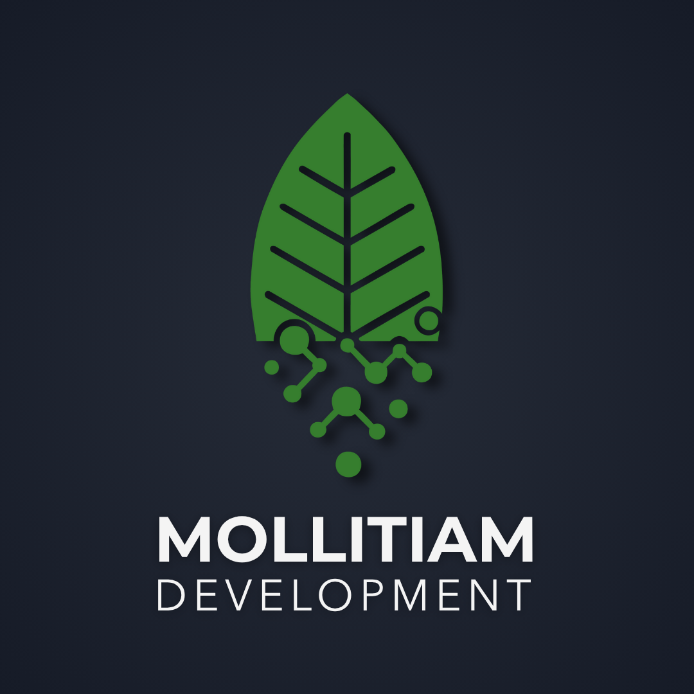
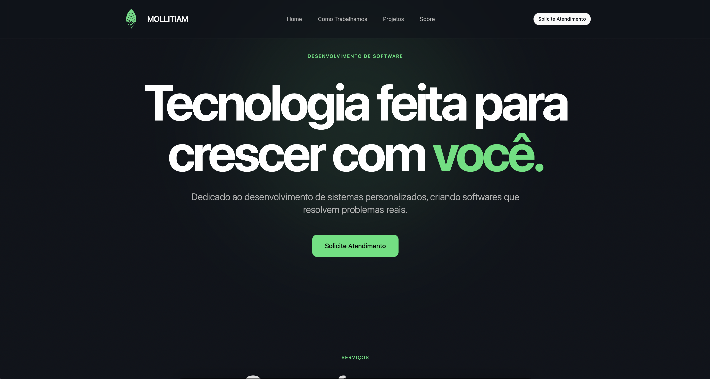
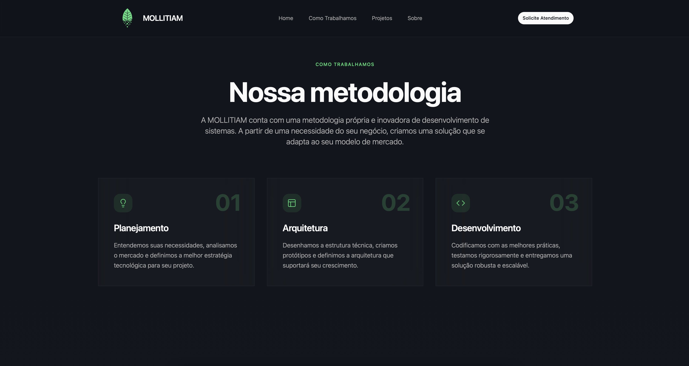
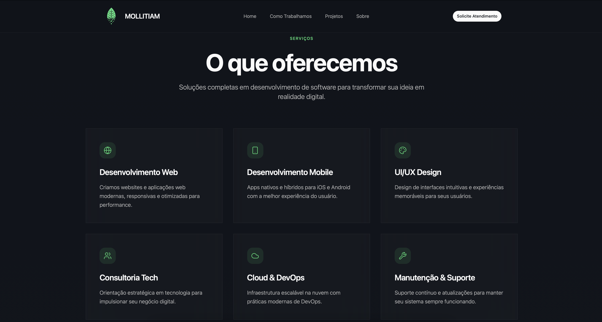
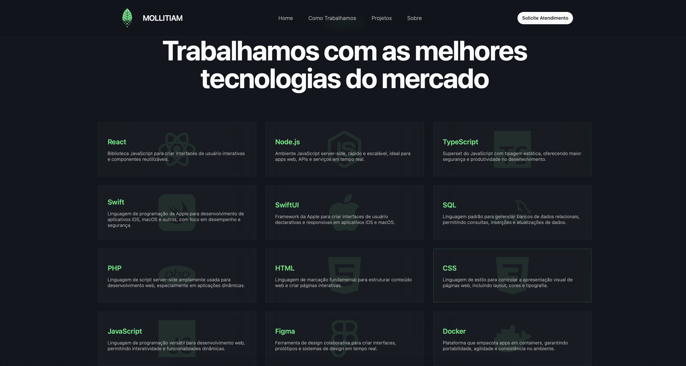
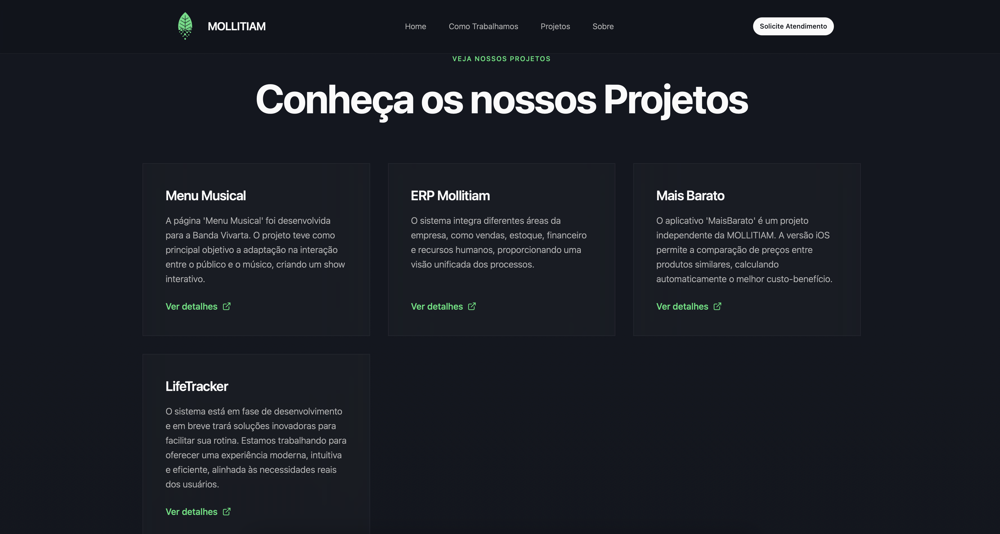
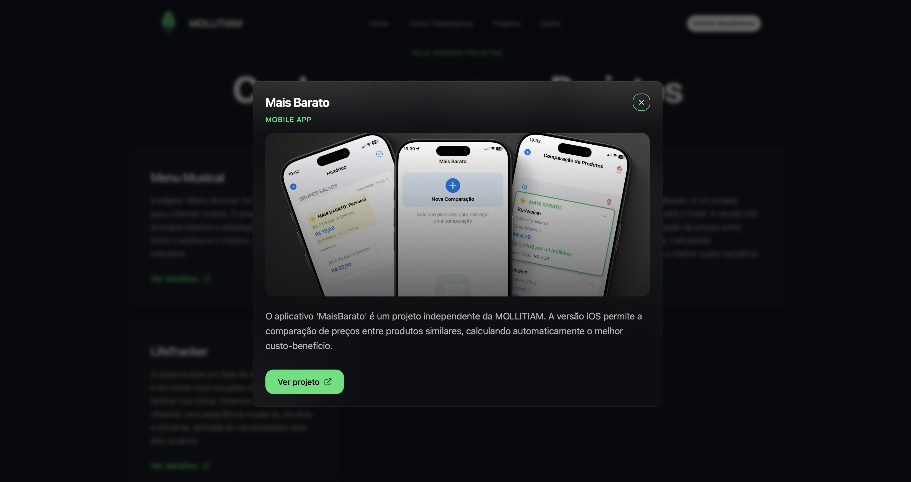
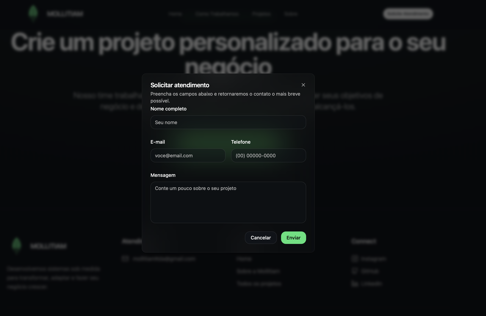
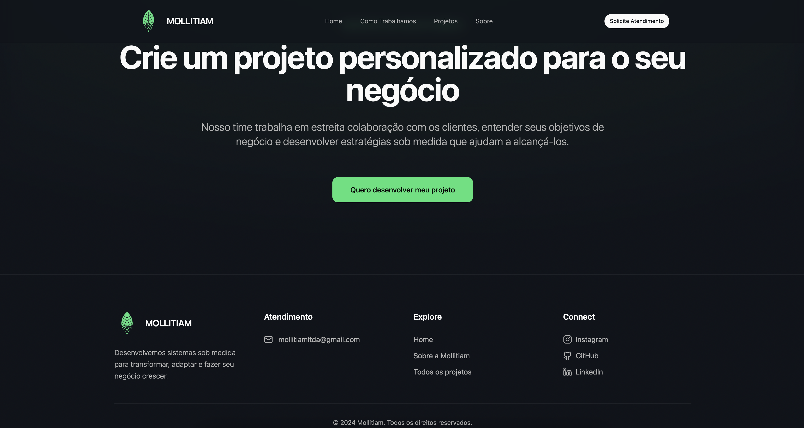

# Site Mollitiam


## Visão Geral

Site institucional da Mollitiam focado em apresentação de serviços, portfólio e captação de clientes. O projeto é um site estático otimizado para SEO, preparado como PWA e com boas práticas de performance (pré-carregamento, DNS prefetch e assets versionados).

- **Produção**: `https://mollitiamdevelopment.great-site.net`
- **Idioma**: pt-BR
- **Padrões**: SEO, Open Graph, Twitter Cards, PWA, acessibilidade básica

## Principais Recursos

- **SEO Completo**: title, description, keywords, canonical, robots (index, follow)
- **Open Graph/Twitter**: metadados para compartilhamento social com imagem (`og-image.jpg`)
- **PWA**: `manifest.json`, tema `#0f1419`, `display: standalone`, ícones SVG maskable
- **Performance**: DNS Prefetch (fonts, analytics), assets minificados e com hash
- **Sitemap/Robots**: `sitemap.xml` e `robots.txt` configurados
- **Âncoras de navegação**: `#home`, `#como-trabalhamos`, `#projetos`, `#sobre`

## Executando Localmente

Como é um site estático, você pode servir com qualquer servidor de arquivos estáticos:

```bash
# via Python
python3 -m http.server 5173
# ou via Node
npx serve -l 5173
# acesse: http://localhost:5173
```

## Deploy

- **Vercel / Netlify / GitHub Pages**: publique o diretório raiz tal como está
- Garanta `Content-Type` correto para `.webp`, `.svg`, `.js`, `.css`
- Habilite HTTPS e compressão (Gzip/Brotli) no provedor

## SEO Checklist

- Atualize `og:image` apontando para uma imagem real em produção
- Mantenha `canonical` em `index.html` com domínio final
- Revise `meta description` para 150–160 caracteres
- Confirme `sitemap.xml` e `robots.txt` em produção

## PWA Checklist

- Ícones: verifique `teste.svg` (maskable). Adicione PNG 192/512 se necessário
- Tema e background: `#0f1419`
- `start_url` e `scope` como `/`
- Opcional: implementar `sw.js` para cache offline (Workbox)

## 📱 Screenshots

### 1. Tela Inicial


### 2. Metodologia da Mollitiam


### 3. O que a Mollitiam Oferece


### 4. Algumas Tecnologias que Usamos


### 5. Projetos da Mollitiam



### 6. Contato com a Mollitiam


### 7. Footer



## Licença

Conteúdo e marca pertencem à Mollitiam. Uso não autorizado é proibido.
